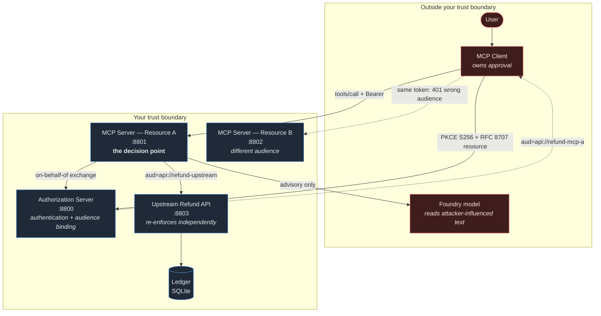

# Who Can Call This MCP Tool?

**OAuth, Resource Binding, and Runtime Policy**
MCP Dev Summit Toronto · 2026-10-06 · 15:40–16:05 · Brian Benz

A runnable demo of the question in the title. An MCP server exposes a `refund_order` tool that moves money. A user is signed in. A client shows an approval dialog. **None of that answers whether this principal may refund this order.**

Everything here runs locally in about ten minutes, with no Azure subscription and no Entra tenant.

**PowerShell** (the rehearsed path):

```powershell
cd demo
.\scripts\bootstrap.ps1
.\scripts\start-all.ps1 -Reset
.\scripts\check.ps1          # 143 tests + 14 scenarios -> READY
```

**Bash** (Git Bash on Windows, Linux, macOS, WSL):

```bash
cd demo
chmod +x scripts/*.sh        # only if your clone lost the executable bit
./scripts/bootstrap.sh
./scripts/start-all.sh --reset
./scripts/check.sh           # 143 tests + 14 scenarios -> READY
```

Every command must be run from the `demo/` directory. A `.ps1` cannot be run by bash and a `.sh` cannot be run by PowerShell — use the twin for the shell you are in. WSL needs its own `bootstrap.sh`, because a Windows `.venv` will not load on Linux; see [SETUP.md](docs/SETUP.md#choosing-a-shell-and-a-note-on-wsl).

**Optionally**, there is a browser view, a Docker Compose deployment, and an AKS deployment. None of them are needed for the talk and none of them change the commands above — see **[DEPLOYMENT.md](docs/DEPLOYMENT.md)**.

```powershell
.\scripts\web.ps1            # browser view over the running services
.\scripts\compose-up.ps1     # the whole demo in five containers
.\scripts\aks-up.ps1         # ...and on Azure Kubernetes Service
```

---

## Architecture and trust boundaries



Red is outside your control **even though it is part of your system**. The client runs on someone else's machine. The model reads text an attacker can write. Neither gets a vote on authorization.

---

## The five layers, and who owns each

| Layer | Owner | Answers | Cannot answer |
| --- | --- | --- | --- |
| MCP Client | The user's vendor — **not you** | *Did the human mean this?* | Whether they are allowed |
| Authorization Server | Your identity platform | *Who are they? For which resource?* | Anything about order `ORD-1003` |
| **MCP Server** | **You** | ***May this principal do this to this object, now?*** | Whether the human meant it |
| Upstream API | You | *Is this still true at mutation time?* | Who was at the keyboard |
| Foundry model | You, but inputs are hostile | *What would a reasonable analyst advise?* | **Nothing. It enforces nothing.** |

Full detail, with denial behaviour and limitations: **[docs/CONTROL-MAP.md](docs/CONTROL-MAP.md)**.

---

## Seven things to take home

1. **Bind every token to one resource.** A token that works at two services is a lateral-movement primitive. RFC 8707, checked on arrival.
2. **Scopes are verbs, not objects.** `refund.write` never named `ORD-1003`. Check the object.
3. **A confirmation dialog is not server authorization.** Assume Approve was clicked, then decide anyway.
4. **Never forward an incoming token downstream.** Exchange it — and if the exchange fails, *fail*. No app-only fallback.
5. **Annotations are hints from an untrusted process.** `readOnlyHint` is documentation, not a permission.
6. **Model output is advice about untrusted input.** Record it; never let it widen authorization.
7. **Audit at the decision point, including denials.** Pseudonymize identifiers, allowlist logged arguments, deny by default.

---

## Try the interesting parts

```powershell
.\scripts\scenario.ps1 discovery              # 401 -> PRM -> AS metadata -> PKCE -> audience-bound token
.\scripts\scenario.ps1 allowed-refund         # applied once; retry does not double-spend
.\scripts\scenario.ps1 wrong-audience         # valid token for Resource B, rejected at Resource A
.\scripts\scenario.ps1 ownership-denial       # the confused deputy: right scope, someone else's order
.\scripts\scenario.ps1 prompt-injection       # hostile note in order data; policy unmoved
.\scripts\scenario.ps1 annotation-tampering   # client lies about readOnlyHint; nothing changes
.\scripts\scenario.ps1 token-passthrough-blocked
.\scripts\scenario.ps1 -All                   # all 14
.\scripts\audit.ps1 -Last 5                   # the evidence trail
```

In bash, use the `.sh` twin of each command — `./scripts/scenario.sh discovery`, `./scripts/scenario.sh --all`, `./scripts/audit.sh 5`.

Every scenario prints the ledger digest **before and after**, so "nothing happened" is demonstrated rather than asserted.

---

## Documentation

| Document | For |
| --- | --- |
| **[SETUP.md](docs/SETUP.md)** | Prerequisites, bootstrap, configuration, troubleshooting |
| **[CONTROL-MAP.md](docs/CONTROL-MAP.md)** | The one-page attendee takeaway |
| **[COVERAGE-MATRIX.md](docs/COVERAGE-MATRIX.md)** | Every promise → implementation → test → evidence |
| [DEPLOYMENT.md](docs/DEPLOYMENT.md) | Four ways to run it: scripts, web UI, Docker Compose, AKS |
| [EVENTS.md](docs/EVENTS.md) | Where this demo has been delivered, and how to reuse it |
| [RUNBOOK.md](docs/RUNBOOK.md) | Presenter: timed schedule, tiers, stop-times, recovery |
| [ONSTAGE-SCRIPT.md](docs/ONSTAGE-SCRIPT.md) | Presenter: literal prompts and narration |
| [RISKS-AND-FALLBACKS.md](docs/RISKS-AND-FALLBACKS.md) | 19 failure modes, detection, prepared fallback |
| [COMPATIBILITY-RECORD.md](docs/COMPATIBILITY-RECORD.md) | Verified versions, SDK API facts, defects found |
| [CLIENT-APPROVAL-CHECKLIST.md](docs/CLIENT-APPROVAL-CHECKLIST.md) | Manual checks no test can prove |
| [APPENDIX.md](docs/APPENDIX.md) | Sequence diagrams, sanitized audit records, KQL, design trade-offs, sources |

---

## Layout

```
demo/
  src/refund_demo/
    tokens.py            # signature, algorithm, issuer, tenant, audience, expiry
    policy.py            # deny-by-default decision point, R001-R299
    ledger.py            # atomic, idempotent mutation
    delegation.py        # on-behalf-of exchange -- no passthrough, no fallback
    audit.py             # pseudonymized evidence at the decision point
    mcp_server/          # Resource A  :8801
    resource_b/          # Resource B  :8802 -- exists to be rejected
    upstream_api/        # refund API  :8803 -- re-enforces everything
    devidp/              # local OAuth AS :8800 -- real RS256/PKCE/RFC 8707
    web/                 # browser view :8080 -- reports decisions, makes none
    client.py            # OAuth client + protocol trace
    scenarios.py         # 14 named stage scenarios
  tests/                 # 143 tests
  scripts/               # PowerShell + bash operator commands
  docker/                # Dockerfile + Compose -- five containers, one image
  k8s/                   # AKS manifests -- one pod, five containers
  infra/                 # Bicep -- compiles; never deployed
  identity/              # Entra registration scripts -- never executed
docs/
```

---

## Honest limitations

Stated here because a talk about authorization should not overclaim.

- **Resource binding stops cross-resource token reuse. It does not stop replay of a stolen token at its intended resource.** Different problem: sender-constrained tokens.
- **The audit log is a JSONL file.** Structured and pseudonymized — but not immutable and not tamper-proof.
- **`AUTH_MODE=entra` has never been executed.** No tenant was authorized for this build. The default and the rehearsed path is the local authorization server, which is a real OAuth server validated by the same code.
- **`demo/infra` has never been deployed.** The Bicep compiles; that is the entire claim.
- **The AKS deployment is verified.** A real cluster was created, the image was built by ACR Tasks, the pod rolled out 5/5 ready with zero restarts, and all 14 scenarios passed against the public IP with a ledger digest identical to the laptop. Manifests are pinned by 48 tests. [DEPLOYMENT.md §7](docs/DEPLOYMENT.md#7-what-is-verified-and-what-is-not).
- **`aks-up.sh` has never driven a real deployment.** The verified run used `aks-up.ps1`; the bash twin is syntax-checked and command-for-command equivalent.
- **The AKS deployment has never been run.** No subscription was authorized. Schema-shaped and test-pinned is not the same as a green rollout.
- **The client approval UI is verified by hand only.** No automated test can prove a dialog appeared.
- **A cancelled request is client-only evidence.** The server never saw it, so it cannot show you a record of refusing it.

Full list: [COVERAGE-MATRIX.md](docs/COVERAGE-MATRIX.md#not-proven--say-so-if-asked).

---

## Security notes

`devidp` issues tokens to anyone who asks. **It must never run anywhere but localhost.** In the container and Kubernetes deployments it stays inside the Compose network and inside the pod respectively — the Kubernetes Service exposes port 8080 and nothing else, deliberately.

All fixtures are synthetic; there is no real customer data. No secret, token, authorization code, or PKCE verifier is ever logged, printed, or committed — `.env` files, keys, and certificates are git-ignored, and `.dockerignore` keeps `.local/` out of every image layer so a signing key cannot be baked into one.

The web interface reports decisions and makes none. Its reset endpoint is disabled over HTTP by default and refused outright in `entra` mode, and the AKS deployment generates a per-deployment access key because the load balancer address is public.
