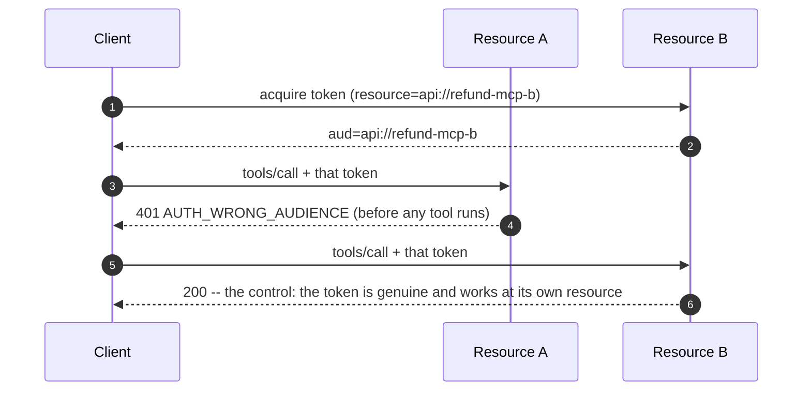

# Appendix

Deeper material deliberately kept **off** the 25-minute path. Nothing here is required to follow the talk.

---

## A. Protocol sequence

```mermaid
sequenceDiagram
    autonumber
    participant U as User
    participant C as MCP Client
    participant AS as Authorization Server
    participant A as MCP Server (Resource A)
    participant API as Upstream Refund API
    participant L as Ledger

    C->>A: POST /mcp  tools/call (no token)
    A-->>C: 401 WWW-Authenticate: Bearer ... resource_metadata="/.well-known/..."
    C->>A: GET /.well-known/oauth-protected-resource
    A-->>C: PRM { authorization_servers, resource: api://refund-mcp-a }
    C->>AS: GET /.well-known/oauth-authorization-server
    AS-->>C: metadata { S256, resource indicators supported }
    C->>AS: GET /authorize  code_challenge_method=S256 & resource=api://refund-mcp-a
    AS->>U: consent (scopes for THIS resource only)
    U-->>AS: approve
    AS-->>C: 302 Location: redirect_uri?code=...
    C->>AS: POST /token  code + code_verifier + resource
    AS-->>C: access_token  aud=api://refund-mcp-a

    C->>A: tools/call refund_order + Bearer
    Note over A: 1. validate signature via JWKS<br/>2. check alg, iss, tid, aud, exp<br/>3. reject app-only / ID tokens
    Note over A: 4. policy.decide(...) deny-by-default
    A->>AS: POST /token  jwt-bearer (on-behalf-of)
    AS-->>A: access_token  aud=api://refund-upstream, SAME sub
    A->>API: POST /refunds + delegated token
    Note over API: re-checks tenant, scope, ownership,<br/>eligibility, balance -- independently
    API->>L: BEGIN IMMEDIATE; apply once by idempotency key
    L-->>API: refund_id
    API-->>A: 201 applied
    A-->>C: result + audit record written
```

The two rejection paths the talk leans on:



---

## B. Sanitized audit records

Real output from this repository, unmodified. `scripts\audit.ps1 -Last 3 -Raw`.

### Allowed refund

```json
{
  "timestamp": "2026-09-14T19:34:04.230+00:00",
  "trace_id": "17b713b3ebb14d92a86dff999d5cfcc5",
  "mcp_request_id": "2",
  "identity_state": "validated",
  "user_pseudonym": "user_6d62234c2192",
  "tenant_id": "devidp-tenant",
  "issuer": "http://localhost:8800",
  "client_id": "copilot-demo-client",
  "granted_scopes": ["Refunds.Read", "Refunds.Write"],
  "resource_audience": "api://refund-mcp-a",
  "tool": "refund_order",
  "arguments": {
    "order_id": "ORD-1001",
    "amount_minor": 4000,
    "currency": "CAD",
    "reason": null,
    "_omitted_keys": ["idempotency_key"]
  },
  "policy_version": "refund-policy/2026-10-06.1",
  "policy_rule_id": "R299",
  "decision": "allow",
  "reason_code": "ALLOW",
  "upstream_audience": "api://refund-upstream",
  "upstream_status": 201,
  "upstream_outcome": "applied",
  "ledger_changed": true,
  "result": "ok",
  "client_approval_evidence": "not-observable-by-server"
}
```

### The idempotent retry — same key, no second movement

```json
{
  "timestamp": "2026-09-14T19:34:07.080+00:00",
  "trace_id": "5524eaa8569f4895a037e4eb202466cb",
  "upstream_status": 200,
  "upstream_outcome": "replayed",
  "ledger_changed": false,
  "decision": "allow",
  "policy_rule_id": "R299"
}
```

> A different `trace_id` (a genuinely separate request), the same outcome, and **`ledger_changed: false`**. That field is what makes "exactly once" auditable rather than asserted.

### Rejected token — no identity attributed

```json
{
  "timestamp": "2026-09-14T19:43:43.207+00:00",
  "trace_id": "3d36274ab0d64beb9034b8c8c8e5e007",
  "identity_state": "untrusted",
  "user_pseudonym": "",
  "tenant_id": "",
  "issuer": "",
  "client_id": "",
  "granted_scopes": [],
  "resource_audience": "api://refund-mcp-a",
  "tool": "<transport>",
  "policy_version": "",
  "policy_rule_id": "",
  "decision": "deny",
  "reason_code": "AUTH_WRONG_AUDIENCE",
  "reason": "token audience does not match this resource (expected one of ['api://refund-mcp-a', 'http://localhost:8801'])",
  "ledger_changed": false,
  "result": "rejected-before-tool-execution",
  "client_approval_evidence": "not-observable-by-server"
}
```

Four deliberate choices in that record:

1. **The token carried a `sub`, a `tid`, and an `azp`. None were recorded.** Validation failed, so those are attacker-supplied strings. Writing them down as identity is how an audit log starts lying to you during an incident.
2. `tool: "<transport>"` — the rejection happened **before** tool dispatch.
3. `client_approval_evidence` is a constant. The server has no trustworthy signal about a client-side dialog, so it records that fact rather than inventing a field.
4. `idempotency_key` appears only under `_omitted_keys`. **Allowlist what you log; denylists lose.**

### What is never written, anywhere

Authorization codes · PKCE verifiers · access, refresh, or ID tokens · client secrets or assertions · full token claim sets · customer free text · raw subject identifiers or tenant GUIDs in `devidp` mode.

---

## C. Application Insights / Log Analytics

`telemetry.py` exports to Azure Monitor when `APPLICATIONINSIGHTS_CONNECTION_STRING` is set. Every audit record written by `audit.write()` is also emitted on the `refund_demo` logger with its fields as `extra`, which `azure-monitor-opentelemetry` maps to `customDimensions` — so the queries below resolve against exactly the fields in `audit.jsonl`. Nested values (`arguments`, `granted_scopes`, `model`) are JSON-encoded, because custom dimensions are string-valued.

Service names, set at app-build time: `mcp-server` (Resource A), `resource-b`, `upstream-refund-api`, `devidp`.

**It is Tier C.** Ingestion regularly lags 2–5 minutes — never wait for it on stage; `scripts\audit.ps1` is instantaneous and offline.

**Every decision for one trace, allowed and denied:**

```kusto
traces
| where timestamp > ago(1h)
| where customDimensions.service_name == "mcp-server"
| extend
    traceId      = tostring(customDimensions.trace_id),
    tool         = tostring(customDimensions.tool),
    decision     = tostring(customDimensions.decision),
    reasonCode   = tostring(customDimensions.reason_code),
    ruleId       = tostring(customDimensions.policy_rule_id),
    policyVer    = tostring(customDimensions.policy_version),
    user         = tostring(customDimensions.user_pseudonym),
    clientId     = tostring(customDimensions.client_id),
    audience     = tostring(customDimensions.resource_audience),
    upstreamAud  = tostring(customDimensions.upstream_audience),
    ledgerMoved  = tobool(customDimensions.ledger_changed)
| project timestamp, traceId, user, clientId, audience, tool, decision, reasonCode, ruleId, policyVer, upstreamAud, ledgerMoved
| order by timestamp desc
```

**Denials by reason code — the operational view that matters:**

```kusto
traces
| where timestamp > ago(24h)
| where tostring(customDimensions.decision) == "deny"
| summarize denials = count() by
    reasonCode = tostring(customDimensions.reason_code),
    ruleId     = tostring(customDimensions.policy_rule_id)
| order by denials desc
```

**Did any denial move the ledger? This must always return zero rows:**

```kusto
traces
| where timestamp > ago(24h)
| where tostring(customDimensions.decision) == "deny"
| where tobool(customDimensions.ledger_changed) == true
| project timestamp, tostring(customDimensions.trace_id), tostring(customDimensions.reason_code)
```

> That last query is worth stealing. It is a continuously-evaluated assertion that your policy layer and your mutation layer have not drifted apart. Alert on it returning anything at all.

---

## D. Design decisions and their trade-offs

### Why a local authorization server

`devidp` is a **real** OAuth 2.1 authorization server: RS256 with a published JWKS, PKCE **S256 only** (`plain` refused), mandatory RFC 8707 resource indicators, single-use authorization codes with a 120-second TTL, and RFC 7523 jwt-bearer for on-behalf-of. Critically, its tokens are validated by the **same `TokenValidator`** that handles Entra tokens — so every boundary demonstrated is genuine, not simulated.

Trade-off: it is not Entra, and `AUTH_MODE=entra` has never been executed. Stated plainly in the README's honest-limitations list.

**`devidp` must never run in a cloud environment.** It issues tokens to anyone who asks.

### Why the client harness captures the redirect instead of opening a browser

Stage reliability. `client.py` reads the `Location` header rather than launching a browser. PKCE, the resource indicator, code single-use, and code redemption are **all still enforced for real** — the only thing removed is a human clicking through a browser under time pressure.

### Why `validate_token_resource=False`

The SDK compares `AccessToken.resource` against `resource_server_url` (an HTTP URL). Our tokens are bound to an App ID URI (`api://refund-mcp-a`) — legitimately different strings. Audience validation is not weakened; `tokens.py` enforces it on every request, rejecting anything else with `AUTH_WRONG_AUDIENCE`. This is the configuration the SDK documents for servers that validate the audience themselves, and it is pinned by `tests/test_tokens.py::test_token_for_resource_b_is_rejected_at_resource_a` and the `wrong-audience` scenario.

### Why denials raise `ToolError`

The SDK wraps any non-`ToolError` exception into a generic `Error executing tool <name>`, **discarding the message**. A denial that cannot state its reason is indistinguishable from a crash — and a demo about authorization decisions that cannot show the decision is worthless. `ToolDenied` subclasses `ToolError` so the reason code and rule ID survive.

### Why there is no app-only fallback

A failed on-behalf-of exchange raises `DelegationError` and the call fails. The tempting alternative — retry with an application token — silently converts a user-scoped request into an application-privileged one, at exactly the moment something is already wrong. **Fail closed.**

### Why reset is not an MCP tool

Any tool is callable by a model, and a model reads attacker-influenced text. `reset` is an operator script (`refund_demo.reset`), removes files only inside `demo/.local/`, refuses to run in `entra` mode without `ALLOW_RESET=1`, and preserves the local signing key so it cannot break running services.

### Why the ledger uses `BEGIN IMMEDIATE`

SQLite's default deferred transaction acquires a write lock late, so two concurrent readers can both decide a refund is affordable before either writes. `BEGIN IMMEDIATE` takes the write lock up front. Proven by `test_concurrent_identical_retries_apply_exactly_once` and `test_concurrent_distinct_refunds_cannot_overdraw`.

### Why idempotency keys are bound to their request

A key replayed with a **different** amount originally returned the first refund — reporting success for something that never happened. It now raises `IDEMPOTENCY_KEY_REUSED`. An idempotency key is a promise about *one specific request*, not a general-purpose cache key.

---

## E. Things this demo deliberately does not solve

| Not covered | Why | What you would actually need |
| --- | --- | --- |
| **Tamper-evident audit** | `audit.jsonl` is an ordinary file | Append-only storage, independent retention, separate trust domain |
| **Token theft / replay at the intended resource** | Resource binding does not address this | Sender-constrained tokens (DPoP, mTLS), short lifetimes, device binding |
| **Step-up authentication for high-value refunds** | Out of scope for 25 minutes | ACR/AMR claim checks, per-transaction re-auth |
| **Dynamic client registration and the OAuth proxy consent variant** | Named in the proposal, conflating it with the runtime confused-deputy case would muddle both | Per-client consent bound to the requesting client |
| **Multi-tenant isolation at scale** | Single synthetic tenant | Tenant-scoped data partitioning and per-tenant policy |
| **Approval receipts** | MCP has no signed approval primitive today | A signed client attestation the server can verify |
| **Rate limiting and anomaly detection** | Orthogonal | Per-principal quotas, velocity checks |
| **Key rotation and JWKS cache poisoning** | Handled by PyJWT's client, not demonstrated | Explicit rotation drills, pinned metadata |

---

## F. Sources

**Specifications**

- MCP specification, revision **2026-07-28** — Authorization. `mcp.types.LATEST_PROTOCOL_VERSION` on the presenting machine.
- RFC 6749 — OAuth 2.0 Authorization Framework
- RFC 7636 — PKCE
- **RFC 8707 — Resource Indicators for OAuth 2.0** (the resource-binding mechanism)
- RFC 9728 — OAuth 2.0 Protected Resource Metadata
- RFC 8414 — OAuth 2.0 Authorization Server Metadata
- RFC 7523 — JWT Profile for Client Authentication and Authorization Grants (the on-behalf-of exchange)
- RFC 9700 — Best Current Practice for OAuth 2.0 Security
- RFC 8693 — OAuth 2.0 Token Exchange (context for delegation)

**Microsoft**

- Microsoft identity platform — on-behalf-of flow
- Microsoft identity platform — access token claims reference (`aud`, `azp`, `idtyp`, `scp`, `roles`, token version)
- Microsoft Graph — application registration (why Bicep cannot create app registrations)
- Azure AI Foundry — managed identity and RBAC

**Security background**

- OWASP — confused deputy problem
- Norm Hardy, *The Confused Deputy* (1988) — the original paper; still the clearest statement of the problem
- OWASP Top 10 for LLM Applications — prompt injection

**In this repository**

- `README.md` — the control table, and the honest-limitations list
- `docs/SETUP.md` — prerequisites, bootstrap, configuration, troubleshooting
- `docs/DEPLOYMENT.md` — the four ways to run it, and the cloud security posture
