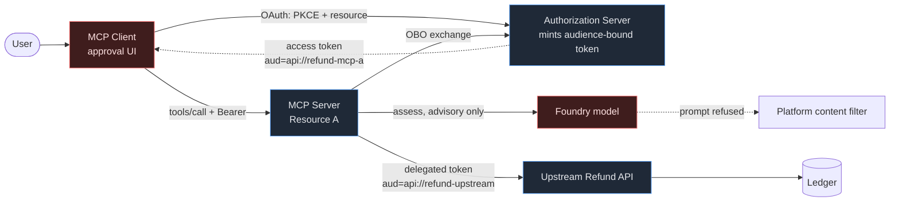

# Control Map

**The attendee takeaway.** One page, five owners, one question each: *who actually stops the bad refund?*

The short answer this demo argues for: **every layer denies something, no layer denies everything, and only one of these layers is yours.** The client's approval dialog is the user's control. The token is the authorization server's control. The decision is the resource server's control — and that is the one you own.

---

## The five layers

Red = **outside your trust boundary**, even though it is part of your system. The client runs on someone else's machine. The model reads attacker-influenced text. Neither can be given a vote on authorization.

---

## Layer 1 — MCP Client

| | |
| --- | --- |
| **Owner** | The end user and their client vendor. **Not you.** |
| **Inputs** | User intent, tool annotations, server metadata |
| **Enforcement point** | Approval / consent UI, before a call is sent |
| **What it denies** | A call the user declines to make |
| **Denial behavior** | The request is never sent; the server sees nothing |
| **Evidence** | `docs/CLIENT-APPROVAL-CHECKLIST.md` B3 (cancel) and C1–C3 (approve, server denies anyway) |
| **Limitations** | ⚠️ Runs on hardware you do not control. Annotations are **hints it chooses to honour**. A modified or malicious client can skip the dialog entirely. Approval ≠ authorization. |

**Proof it is not sufficient:** `scenario.ps1 annotation-tampering` — the client sends `readOnlyHint: true` on `refund_order`; the server's decision does not move.

## Layer 2 — Authorization Server

| | |
| --- | --- |
| **Owner** | You / your identity platform (Entra ID, or `devidp` locally) |
| **Inputs** | Client identity, PKCE verifier, RFC 8707 `resource`, requested scopes, user consent |
| **Enforcement point** | `/authorize` and `/token` |
| **What it denies** | PKCE downgrade to `plain`; a token request with no resource indicator; a scope the user has not consented to; a confidential-client exchange without a valid assertion |
| **Denial behavior** | OAuth error; **no token is issued** |
| **Evidence** | `scenario.ps1 pkce-downgrade`, `scenario.ps1 missing-resource-indicator`, `tests/test_discovery.py` |
| **Limitations** | Knows *who* and *for which resource*. Knows nothing about order `ORD-1003`, refund eligibility, or dollar limits. It cannot make a business decision, and asking it to is a category error. |

**The control it provides:** every token is **audience-bound**. A token is minted for one resource and is worthless at any other.

## Layer 3 — MCP Server (Resource A) — *the layer you own*

| | |
| --- | --- |
| **Owner** | You |
| **Inputs** | Bearer token, JWKS from the trusted issuer, tool name and arguments, the ledger |
| **Enforcement point** | `tokens.py` (`TokenValidator`) then `policy.py` (`decide`), before any side effect |
| **What it denies** | See both tables below |
| **Denial behavior** | 401 with `WWW-Authenticate` + `resource_metadata`, or a `ToolError` carrying a reason code and rule ID. **No mutation occurs.** |
| **Evidence** | `scripts\audit.ps1`; ledger digest identical before and after every denial |
| **Limitations** | Cannot know whether the human at the keyboard *meant* it — that is Layer 1's job. Trusts its issuer's signing keys and the ledger as the authority on ownership. |

**Token validation (`tokens.py`)** — rejected before policy runs:

| Code | Rejects |
| --- | --- |
| `AUTH_NO_TOKEN` | No bearer token → 401 + where to authenticate |
| `AUTH_DISALLOWED_ALGORITHM` | Anything but RS256/384/512 — blocks `alg: none` and HS256 confusion |
| `AUTH_BAD_SIGNATURE` / `AUTH_UNKNOWN_SIGNING_KEY` | Forged or unknown-key tokens |
| **`AUTH_WRONG_AUDIENCE`** | **A valid token minted for Resource B** |
| `AUTH_WRONG_ISSUER` / `AUTH_WRONG_TENANT` | Foreign issuer or tenant |
| `AUTH_TOKEN_EXPIRED` / `AUTH_TOKEN_NOT_YET_VALID` | Lifetime violations |
| `AUTH_APP_ONLY_TOKEN` | App-only tokens — there is no user to act for |
| `AUTH_WRONG_TOKEN_TYPE` | An ID token presented as an access token |

**Policy (`policy.py`, deny-by-default, version `refund-policy/2026-10-06.1`):**

| Rule | Code | Denies |
| --- | --- | --- |
| R001 | `POLICY_CLIENT_NOT_ALLOWED` | An unapproved client application |
| R002 | `POLICY_UNKNOWN_TOOL` | Any tool not explicitly governed |
| R003 | `POLICY_MISSING_SCOPE` | Missing the delegated scope for this tool |
| R004 | `POLICY_UNKNOWN_PRINCIPAL` | A validated subject who is not a known employee |
| R005 | `POLICY_ORDER_NOT_FOUND` | A non-existent order |
| **R006** | **`POLICY_ORDER_NOT_ASSIGNED`** | **The confused deputy: correct scope, someone else's order** |
| R200 | `POLICY_ORDER_NOT_REFUNDABLE` | An ineligible order |
| R201 | `POLICY_AMOUNT_INVALID` | Zero, negative, or malformed amounts |
| R202 | `POLICY_CURRENCY_MISMATCH` | Currency that is not the order's own |
| R203 | `POLICY_AMOUNT_EXCEEDS_PER_CALL_LIMIT` | Above the per-call ceiling |
| R204 | `POLICY_AMOUNT_EXCEEDS_BALANCE` | More than the remaining balance |
| R100 / R299 | `ALLOW` | Read / refund permitted — every check above passed |

## Layer 4 — Upstream Refund API

| | |
| --- | --- |
| **Owner** | You (a separate service, separate audience) |
| **Inputs** | A **delegated** token with `aud = api://refund-upstream`, obtained by on-behalf-of exchange |
| **Enforcement point** | `upstream_api/app.py` `_authenticate`, then its own ownership and amount checks |
| **What it denies** | A forwarded MCP token (wrong audience); a delegated token whose user does not own the order; a duplicate idempotency key reused with different parameters |
| **Denial behavior** | 401/403; **the ledger transaction never opens** |
| **Evidence** | `scenario.ps1 token-passthrough-blocked`; `tests/test_delegation.py`; `tests/test_idempotency.py` |
| **Limitations** | Trusts the same issuer. It re-checks; it does not independently re-authenticate the human. |

**This layer exists to make one point:** the MCP server's own token is **useless** here. There is no passthrough and no app-only fallback — a failed on-behalf-of exchange raises `DelegationError` and the call fails closed rather than quietly escalating to application privilege.

## Layer 5 — Foundry-backed assessment

| | |
| --- | --- |
| **Owner** | You, but the **inputs are attacker-influenced** |
| **Inputs** | Order data including free-text customer notes |
| **Enforcement point** | **None. This layer enforces nothing.** |
| **What it denies** | Nothing. It produces advice. |
| **Denial behavior** | n/a — its output is recorded, never obeyed |
| **Evidence** | `scenario.ps1 prompt-injection`: a note instructs the model to approve an unlimited refund; the policy decision is unchanged |
| **Limitations** | ⚠️ A model reading untrusted text **is an untrusted input channel**. When offline it returns `live: false` with an explicit `[OFFLINE ASSESSMENT - NO MODEL WAS CALLED]` prefix so advisory output can never be mistaken for a live result. |

**The rule:** model output may inform a human. It may never be a term in an authorization decision.

### Layer 5b — the platform content filter

Configure a Foundry endpoint and a fourth actor appears that is worth naming out loud, because it belongs to **neither this application nor MCP**:

| | |
| --- | --- |
| **Owner** | The model platform (Azure AI Content Safety), configured outside the app |
| **Enforcement point** | The inference endpoint, before the model generates |
| **What it denies** | Prompts it judges hostile. The injected order notes in `ORD-1005` are refused outright |
| **Denial behavior** | A 400 the app reports as `filtered: true`, `handled_by: platform content filter` — a **result**, not an outage |
| **Evidence** | `scenario.ps1 prompt-injection` with `FOUNDRY_ENDPOINT` set: `assessment_was_blocked_by_content_filter: True` |
| **Limitations** | ⚠️ Still not the authorization boundary. It is best-effort, it is not under your control, and it can be tuned or disabled by whoever owns the resource. |

**Why it is in the demo:** it shows that a control can live in the platform rather than in your code, and that MCP composes with tooling it knows nothing about. It also makes the central point harder to dodge — **two** independent layers declined the injected content, and *neither* is what stops the refund. The policy engine denies `ORD-1003` identically whether the filter fired, the model answered, or nothing was configured at all.

---

## Audit: evidence, not enforcement

Every decision writes one record to `audit.jsonl` tying together **request → user → client → resource → policy version → rule → result → ledger change**. Users and tenants are pseudonymized (`user_6d62234c2192`); arguments are allowlisted, so an idempotency key never lands in a log.

Rejected tokens are recorded as `identity_state: "untrusted"` with **no attributed user or tenant** — claims that failed validation are attacker-supplied strings and must not be written down as if they were facts.

> **Say this plainly:** this is a JSONL file on a disk. It is a well-structured application log and nothing more. It is **not** immutable and **not** tamper-proof. Real tamper-evidence needs append-only storage with independent retention — a different talk, and a real one.

---

## Take this home

1. **Bind every token to one resource.** A token that works at two services is a lateral-movement primitive. RFC 8707 resource indicators, checked on arrival.
2. **Scopes say what kind of thing you may do. They never say which object.** `refund.write` plus `ORD-1003` is still the confused deputy. Check the object.
3. **A confirmation dialog is not server authorization.** Assume Approve was clicked, then decide anyway.
4. **Never forward an incoming token to a downstream API.** Exchange it. If the exchange fails, fail — do not fall back to app-only.
5. **Annotations are hints from an untrusted process.** `readOnlyHint` is documentation, not a permission.
6. **Model output is advice about untrusted input.** Record it; never let it widen authorization.
7. **Write the audit record at the decision point,** including denials, and pseudonymize identifiers. Deny-by-default, so a tool you forgot to govern is refused rather than allowed.
