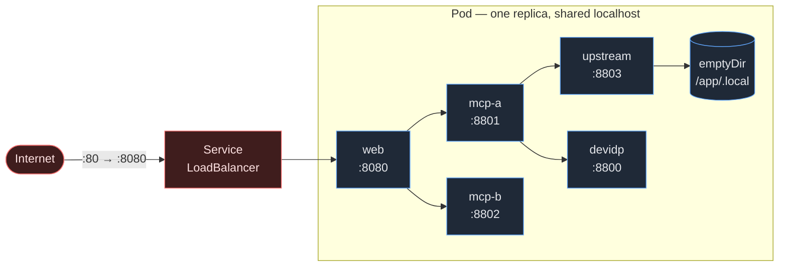

# Deployment

Four ways to run this demo. They exist for different rooms, not as alternatives of equal standing.

| Mode | Use it when | Needs | Status |
| --- | --- | --- | --- |
| **1. Operator scripts** | **On stage. This is the rehearsed path.** | Python 3.12 | Verified |
| **2. Scripts + web UI** | A browser view helps the back row read the verdicts | Python 3.12 | Verified |
| **3. Docker Compose** | Handing the demo to someone who has Docker and nothing else | Docker Desktop | Verified: built and all 14 scenarios pass in containers |
| **4. Azure Kubernetes Service** | Remote audience, shared link, or the "what would this look like hosted" question | Azure subscription, `az`, `kubectl` | Manifests validated; **never deployed** |

**Nothing in the 25-minute talk requires modes 3 or 4.** They are additions. Mode 1 is unchanged by their existence — same scripts, same commands, same output.

Every command below is run from the `demo/` directory.

---

## 1. Operator scripts — the rehearsed path

This is [SETUP.md](SETUP.md) §4 and §5, restated here only so the four modes sit side by side.

| Task | PowerShell | Bash |
| --- | --- | --- |
| Bootstrap | `.\scripts\bootstrap.ps1` | `./scripts/bootstrap.sh` |
| Start the four services | `.\scripts\start-all.ps1 -Reset` | `./scripts/start-all.sh --reset` |
| Full verification | `.\scripts\check.ps1` | `./scripts/check.sh` |
| One scenario | `.\scripts\scenario.ps1 wrong-audience` | `./scripts/scenario.sh wrong-audience` |
| Stop | `.\scripts\stop-all.ps1` | `./scripts/stop-all.sh` |

A `.ps1` cannot be run by bash and a `.sh` cannot be run by PowerShell. Use the twin for the shell you are in.

---

## 2. Scripts plus the web UI

The web front end is a **reporting surface, not a decision point**. It runs scenarios and renders what came back. Every allow and every deny in it was decided by the MCP server; the page cannot authorize anything, and it holds no policy of its own. That distinction is the whole talk, so it is enforced in code and pinned by tests rather than described in a comment.

Start the four services first, then add the view:

| Task | PowerShell | Bash |
| --- | --- | --- |
| Serve the UI | `.\scripts\web.ps1` | `./scripts/web.sh` |
| On another port | `.\scripts\web.ps1 -Port 9000` | `./scripts/web.sh --port 9000` |

Then open <http://localhost:8080>.

The page shows the 14 scenarios with the claim each one makes, a PASS/FAIL badge, the full protocol trace for the selected run, the live ledger digest, and the audit tail. It is a single self-contained HTML document: no CDN, no build step, no external requests. A test asserts that, because a demo about trust boundaries should not fetch a script from someone else's CDN in front of an audience.

### What the UI deliberately will not do

- **Reset is off.** `POST /api/reset` returns `403` unless `WEB_ALLOW_RESET=1`, and it is still refused outright in `AUTH_MODE=entra`. Reset mutates the ledger; it stays an operator action.
- **Runs are serialized.** One scenario at a time, so two clicks cannot interleave against one ledger and produce a digest nobody can explain.
- **No secrets are rendered.** Tokens, codes and PKCE verifiers never reach the page.

### Optional access key

Set `WEB_ACCESS_KEY` and every route except `/health` requires it, as an `X-Demo-Key` header or a `?k=` query parameter. `/health` stays open so container and Kubernetes probes keep working.

```powershell
$env:WEB_ACCESS_KEY = 'something-long'
.\scripts\web.ps1
# then open http://localhost:8080/?k=something-long
```

This is a shared secret over HTTP. It keeps a casual passer-by off the page; it is not authentication, and it is not what the talk is arguing for.

---

## 3. Docker Compose

Five containers from one image: `devidp`, `upstream`, `mcp-a`, `mcp-b`, `web`. One image for all five, so a token minted by the issuer and validated by a resource server cannot drift apart between builds.

| Task | PowerShell | Bash |
| --- | --- | --- |
| Build and start | `.\scripts\compose-up.ps1` | `./scripts/compose-up.sh` |
| Start without rebuilding | `.\scripts\compose-up.ps1 -NoBuild` | `./scripts/compose-up.sh --no-build` |
| Stop, keep the ledger | `.\scripts\compose-down.ps1` | `./scripts/compose-down.sh` |
| Stop and wipe state | `.\scripts\compose-down.ps1 -Volumes` | `./scripts/compose-down.sh --volumes` |

Both wrappers wait until all five containers report **healthy** before printing the URL, so a green prompt means the services actually answered, not that Docker created something.

Published on the host:

```
http://localhost:8080                                           web UI
http://localhost:8800/.well-known/openid-configuration          issuer metadata
http://localhost:8801/.well-known/oauth-protected-resource      Resource A metadata
http://localhost:8802/.well-known/oauth-protected-resource      Resource B metadata
```

### One thing that is different under Compose

Inside the network the containers address each other by **service name** (`http://mcp-a:8801`), and those are the identifiers the metadata advertises. An MCP client running on your host will be pointed at `http://mcp-a:8801` by the protected-resource metadata and will not resolve it.

That is not a bug to work around — it is what happens when issuer, resource identifier and network address stop agreeing, which is the same class of mistake the `wrong-audience` scenario is about. **For the live-client segment, use mode 1.**

### State

All five containers share one named volume mounted at `/app/.local`: one ledger, one audit log, one signing key. `compose-down` keeps it so a restart resumes where you were; `-Volumes` / `--volumes` drops it, which is the container equivalent of resetting with a fresh key.

Because the volume survives a restart, **running the full scenario set twice without wiping it will fail `allowed-refund` the second time** — the order has already been refunded and the demo is correctly refusing to double-spend. That is the ledger working, not a flake. Wipe state between full runs:

```powershell
.\scripts\compose-down.ps1 -Volumes ; .\scripts\compose-up.ps1
```

A clean ledger fingerprints as `211597d92491…` in Compose, which is byte-identical to a clean ledger on the laptop.

The ledger is SQLite. **Nothing here scales past one writer**, which is why the Kubernetes deployment below is a single pod rather than something that looks more impressive and works less well.

---

## 4. Azure Kubernetes Service

> **Never deployed.** The manifests are schema-checked and pinned by 46 tests; no cluster was created during the build, because no subscription was authorized for it. Budget real time the first time, and never do it for the first time on the day of a talk.

### Prerequisites

- An Azure subscription you are willing to spend money on
- `az` (2.88+) — `az login`
- `kubectl` (1.30+)
- **No local Docker required.** The image is built by ACR Tasks, server-side.

### Deploy

| Task | PowerShell | Bash |
| --- | --- | --- |
| Deploy | `.\scripts\aks-up.ps1` | `./scripts/aks-up.sh` |
| Pick a region | `.\scripts\aks-up.ps1 -Location westeurope` | `./scripts/aks-up.sh --location westeurope` |
| Skip the prompt | `.\scripts\aks-up.ps1 -Yes` | `./scripts/aks-up.sh --yes` |
| **Tear down** | `.\scripts\aks-down.ps1` | `./scripts/aks-down.sh` |

The script prints the subscription, region, registry, cluster and image tag, warns that this creates billable resources, and waits for confirmation. Then, in order: resource group → container registry → `az acr build` → AKS cluster → `az aks get-credentials` → apply `k8s/` → wait for rollout → print the public URL.

Repeat runs are idempotent: existing resource group, registry and cluster are reused, and only a fresh image tag and a rolling replacement are applied.

### The shape of the deployment, and why

**One pod, five containers, one `emptyDir`.**

That looks wrong until you remember the ledger is SQLite. One writer is a hard constraint, so the only real question is where the other four containers go. Putting them in the same pod means they share a network namespace and reach each other on `localhost` — the identical configuration that runs on a laptop — and there is no `ReadWriteMany` storage class and no SQLite-over-SMB locking to go wrong.

It is a demo, not a reference architecture for hosting MCP servers. The talk says that out loud; the manifest should not quietly contradict it.



**Only `web` is exposed.** `devidp` mints tokens for anyone who asks. Putting a development issuer on a public address would undercut the entire point of the talk, so the Service selects port 8080 and nothing else.

### Security posture

| Control | Setting |
| --- | --- |
| Access key | Generated per deployment and stored in a Secret; printed once in the final URL |
| Reset endpoint | Off (`WEB_ALLOW_RESET=0` in the ConfigMap) |
| User | Non-root uid 10001, `runAsNonRoot: true`, `fsGroup: 10001` |
| Filesystem | `readOnlyRootFilesystem: true`; writes confined to the mounted state and `/tmp` |
| Capabilities | All dropped; `allowPrivilegeEscalation: false`; `seccompProfile: RuntimeDefault` |
| API access | `automountServiceAccountToken: false` |
| Limits | CPU and memory requests and limits on every container |
| Exposure | `devidp`, `mcp-a`, `mcp-b`, `upstream` stay inside the pod |

Pass `--no-access-key` / `-NoAccessKey` to leave the UI ungated. Only do that for a cluster nobody else can reach.

All fixtures are synthetic. There is no real customer, order, or credential anywhere in this deployment, and there must never be.

### Tear it down

```powershell
.\scripts\aks-down.ps1
```

Deletes the whole resource group — cluster, registry, load balancer, public IP, managed identity — and removes the stale kubeconfig entry. It lists what it is about to delete and requires you to type the resource group name.

**A demo cluster left running over a conference weekend is a real bill.** Tear it down the same day.

---

## 5. When the image build cannot reach PyPI

`docker compose build` can fail like this:

```
SSLError(SSLError(1, '[SSL: SSLV3_ALERT_HANDSHAKE_FAILURE] ...'))
  host='files.pythonhosted.org'
```

This is the network, not the Dockerfile. Some corporate networks allow `pypi.org` (the index) but block `files.pythonhosted.org` (the CDN that serves the actual wheels), so dependency resolution begins and then dies on the first download.

It was reproduced on the machine this demo was built on — from the host **and** inside the build, identically — and then it cleared on its own a day later, at which point the image built first time. Treat it as a property of the room you are in, not of the repository. Check it before you rely on mode 3 at an event, because it can come back.

Three ways through it:

1. **Deploy to AKS instead.** `az acr build` builds server-side, where PyPI is reachable. The cloud path is unaffected by this block — that is not a coincidence, it is why the image is built by ACR Tasks rather than pushed from a laptop.
2. **Point the build at an internal mirror.** The Dockerfile takes build arguments for exactly this:

   ```bash
   docker compose -f docker/docker-compose.yml build \
     --build-arg PIP_INDEX_URL=https://pkgs.example.com/pypi/simple \
     --build-arg PIP_TRUSTED_HOST=pkgs.example.com
   ```

3. **Use mode 1 or 2.** The operator scripts need no image at all, and they are the rehearsed path regardless.

Confirming it is the network rather than your setup takes one command:

```bash
curl -sS -o /dev/null -w '%{http_code}\n' https://pypi.org/simple/              # 200
curl -sS -o /dev/null -w '%{http_code}\n' https://files.pythonhosted.org/simple/ # 404 = reachable
```

A `404` from the second URL is the **good** answer: that path does not exist, so the CDN is answering you. A TLS error is the bad one.

---

## 6. Configuration reference

Every setting is an environment variable; containers set them through the Compose `environment` block or the Kubernetes ConfigMap.

| Variable | Default | Purpose |
| --- | --- | --- |
| `AUTH_MODE` | `devidp` | `devidp` or `entra` |
| `BIND_HOST` | *(unset)* | Overrides the listen address. **Containers must set `0.0.0.0`** — `devidp` binds loopback by default, which is right on a laptop and wrong in a container |
| `DEVIDP_ISSUER` | `http://localhost:8800` | Issuer identifier, and the base for JWKS and metadata |
| `MCP_A_PUBLIC_URL` | `http://localhost:8801` | Resource A identifier as advertised in metadata |
| `MCP_B_PUBLIC_URL` | `http://localhost:8802` | Resource B identifier |
| `UPSTREAM_API_URL` | `http://localhost:8803` | Upstream refund API |
| `WEB_PORT` | `8080` | Web UI port |
| `WEB_ALLOW_RESET` | `0` | Enables `POST /api/reset`. Still refused in `entra` mode |
| `WEB_ACCESS_KEY` | *(unset)* | Shared secret for every route except `/health` |
| `MCP_ALLOWED_HOSTS` | *(unset)* | Extra `Host` header values the MCP transport accepts, comma separated (`mcp-a:*,mcp-b:*`). Loopback is always allowed |

Issuer and resource URLs must stay consistent with each other. If a token says `aud=http://mcp-a:8801` and Resource A believes it is `http://localhost:8801`, every call fails audience validation — correctly, and confusingly.

### Two things that only break in containers

Both were found by running the stack, not by reading it, and both now have tests.

**`421 Misdirected Request` from an MCP server.** The MCP SDK turns on DNS rebinding protection whenever the server is built for a loopback host, and then accepts only `localhost` / `127.0.0.1` / `[::1]` in the `Host` header. On a laptop you never notice. Under Compose the Host header is the service name — `mcp-a:8801` — and every tool call is rejected *after* a completely successful OAuth handshake, which makes it look like a token problem when it is not. `MCP_ALLOWED_HOSTS` extends the allowlist; the protection stays on, because switching it off in a talk about authorization would be a poor look. A single pod on AKS does not need it: there, the containers really are talking over loopback.

**The test suite fails while Compose is up.** The integration tests bind their own services on 8800–8803, so if the containers already hold those ports you get a wall of `httpx.ConnectError`. Run `scripts/compose-down.ps1` first. Nothing is wrong.

---

## 7. What is verified, and what is not

Said plainly, because a talk about authorization should not overclaim.

**Verified by execution:**

- Modes 1 and 2, in PowerShell and bash: 141 tests, 14 scenarios, `READY` from `check`.
- The web API end to end against live services: health, scenario listing, a real run, ledger digest, audit tail, and `403` on reset.
- **Mode 3 end to end.** The image builds, all five containers report healthy, and **all 14 scenarios pass inside Compose** with the ledger moving only on the scenario that is supposed to move it.
- The clean-ledger digest is **identical** in Compose and on the laptop (`211597d92491…`), so the seeded data and the fingerprint agree across environments.
- Image layout: source lands at `/app/src`, `.local` resolves to `/app/.local`, `.venv` and `tests` are excluded, and the non-root user can write the state directory.
- Compose file syntax via `docker compose config`; Dockerfile lint via `docker build --check` (no warnings).
- Manifest structure and cross-file agreement, via 46 tests that fail if Compose, Kubernetes and the Dockerfile stop describing the same demo.
- Teardown behaviour on a non-existent resource group, in both shells, and identical registry-name derivation between them.

**Not verified:**

- **The AKS deployment has never run.** No subscription was authorized. Manifests are schema-shaped and test-pinned, which is not the same as a green rollout. The image build and the application itself are now proven under Compose, which removes most — not all — of the risk.
- **`AUTH_MODE=entra` has never been executed**, in any mode.
- **`demo/infra` Bicep has never been deployed.** It compiles; that is the whole claim.
- **`readOnlyRootFilesystem: true` has never been exercised against a live pod.** Compose does not set it. If a container crashloops on AKS, that is the first thing to relax.

---

## See also

- [SETUP.md](SETUP.md) — prerequisites, bootstrap, configuration, troubleshooting
- [RUNBOOK.md](RUNBOOK.md) — timed presenter schedule and recovery
- [RISKS-AND-FALLBACKS.md](RISKS-AND-FALLBACKS.md) — failure modes including the deployment ones
- [EVENTS.md](EVENTS.md) — where this demo has been delivered
